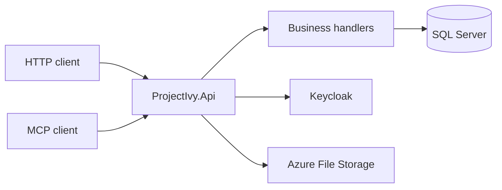

# Project Ivy API

Personal API for Project Ivy: money, travel, location, media, and day-to-day records behind one authenticated HTTP surface. It is an ASP.NET Core application on .NET 10 that talks to an existing SQL Server database.

Swagger UI is served at `/swagger`. An MCP endpoint is mapped at `/mcp` for a small set of tools (expenses and beer volume).

## What it covers

| Area | Examples |
| --- | --- |
| Money | Accounts, banks, cards, expenses, income, loans, vendors |
| Travel | Trips, stays, flights, airports, rides, cars, routes |
| Place | Tracking, geohash, points of interest, cities, countries |
| Life | Calendar, journal, to-dos, work days, calls, people, inventory |
| Media | Movies, beer, Last.fm artists and tracks |
| Files | Azure File Storage |

Every controller action requires an authenticated user. The current user comes from the Keycloak email claim.

## Stack

- ASP.NET Core on .NET 10, controllers and handler classes
- Entity Framework Core against an existing SQL Server database (no migrations in this repo)
- Keycloak JWT bearer authentication, with scope policies
- Swagger, Serilog (console, rolling file, Graylog), Prometheus metrics
- MCP tools that call the same handlers as the HTTP API



## Requirements

- [.NET 10 SDK](https://dotnet.microsoft.com/download)
- SQL Server database already shaped for `MainContext`
- A Keycloak realm that issues tokens for this API
- Graylog, if you want the process to start (the logger is configured in `Main`)

## Configuration

Settings come from `src/ProjectIvy.Api/appsettings.json` and environment variables. Do not commit connection strings or secrets.

These are read when the process starts. A missing value stops startup.

| Variable | Used for |
| --- | --- |
| `OAUTH_AUTHORITY` | Keycloak realm issuer for bearer validation, MCP discovery, and Swagger OAuth URLs |
| `GRAYLOG_HOST` | Serilog Graylog sink |
| `GRAYLOG_PORT` | Serilog Graylog sink (integer) |
| `CONNECTION_STRING_AZURE_STORAGE` | Azure File Storage client |

These are read when the matching feature runs:

| Variable | Used for |
| --- | --- |
| `CONNECTION_STRING_MAIN` | SQL Server connection opened by handlers |
| `LAST_FM_KEY` | Last.fm requests |

`USE_HTTP2`, when set to any value, makes Kestrel serve HTTP/2. Leave it unset for the default HTTP/1.1 listener.

Keycloak itself is the `Keycloak` section in `appsettings.json` (`realm`, `auth-server-url`, `resource`). Override any of those with the usual ASP.NET Core environment variable form, for example `Keycloak__realm`.

REST bearer validation uses the `Keycloak` settings, with optional `Authentication:Schemes:Bearer` overrides. MCP bearer validation uses `OAUTH_AUTHORITY` (the full HTTPS realm issuer). HTTP endpoints accept bearer headers or the `AccessToken` cookie; MCP requires a bearer header on every request.

## Run locally

```bash
export OAUTH_AUTHORITY="https://your-keycloak/realms/ivy"
export Mcp__Resource="https://your-api/mcp"
export GRAYLOG_HOST="localhost"
export GRAYLOG_PORT="12201"
export CONNECTION_STRING_AZURE_STORAGE="DefaultEndpointsProtocol=https;AccountName=...;AccountKey=...;EndpointSuffix=core.windows.net"
export CONNECTION_STRING_MAIN="Server=localhost;Database=ProjectIvy;User Id=...;Password=...;TrustServerCertificate=True"
export LAST_FM_KEY="your-lastfm-key"

dotnet run --project src/ProjectIvy.Api
```

Then open `/swagger`. The listening URL is whatever Kestrel prints at startup (typically `http://localhost:5000` when no `launchSettings.json` is present).

```bash
dotnet build ProjectIvy.sln
dotnet test test/ProjectIvy.Data.Test/ProjectIvy.Data.Test.csproj
```

## End-to-end tests

`test/ProjectIvy.Api.EndToEnd.Test` hosts the API in-process and runs real SQL queries against disposable **SQL Server 2025 CU9** containers (`2025-CU9-ubuntu-24.04`). It covers `POST /expense` and collection `GET /expense`. Keycloak authentication is replaced by a test scheme while the real scope policies remain active. Azure Storage, Last.fm, and calendar interfaces use strict mocks, and factory-created outbound HTTP requests fail immediately. The covered endpoints do not use other external SDK clients.

Prerequisites are the .NET 10 SDK, a running Docker daemon, and the committed `Schema/Main.dacpac` snapshot. Give Docker at least 4 GB RAM; 6 GB is recommended. Tests need neither production credentials nor a production connection. The first run downloads the pinned container image.

### Refresh the schema explicitly

Obtain a connection string using credentials with metadata-read access (`VIEW DEFINITION` for the whole database). Set `E2E_SCHEMA_SOURCE_CONNECTION_STRING` securely in your shell; do not put it in tracked files or paste it into logs. `CONNECTION_STRING_MAIN` is never used for extraction.

```bash
bash scripts/refresh-e2e-schema.sh
```

This restores a pinned SqlPackage tool, extracts the whole schema without table data, permissions, or login mappings, and validates deployment in a temporary SQL Server 2025 container. Only a successful validation replaces `test/ProjectIvy.Api.EndToEnd.Test/Schema/Main.dacpac`; review and commit that artifact. Failed extraction or validation preserves the previous snapshot. Failed SqlPackage extraction prints its exit code and diagnostics with the source connection, password, username, server, and database redacted. The source connection is passed directly to the SqlPackage child process; use a trusted local workstation and avoid shell tracing (`set -x`).

The initial snapshot must be exported from the actual database; EF models are not a substitute. Schema export is never part of test execution or CI. Security principals, permissions, linked servers, credentials, and external data sources are excluded from test deployment; application database objects and constraints are retained. Schemas whose application objects depend on excluded integrations fail validation rather than enabling a production dependency.

### Run and troubleshoot

```bash
dotnet test test/ProjectIvy.Api.EndToEnd.Test/ProjectIvy.Api.EndToEnd.Test.csproj
# These setup safety tests also run without Docker or a schema snapshot:
dotnet test test/ProjectIvy.Api.EndToEnd.Test/ProjectIvy.Api.EndToEnd.Test.csproj --filter FullyQualifiedName~SetupSafetyTests
```

One container serves the suite; each test gets a new database with synthetic users, currency, language, and expense types. The test host and cache are recreated per test. Tests run serially because handlers use process environment variables. Those variables are replaced before startup and restored even on failure. Unique user emails avoid stale entries in the handlers' static user cache. No migrations or `EnsureCreated` are used.

- **Missing `Main.dacpac`:** run the explicit refresh command and rebuild. Tests never fall back to production or export schema themselves.
- **Docker unavailable:** start your Docker runtime and check `docker info`. For Colima, configure `DOCKER_HOST=unix://$HOME/.colima/default/docker.sock` if Testcontainers does not discover it; `TESTCONTAINERS_DOCKER_SOCKET_OVERRIDE=/var/run/docker.sock` may also be needed for its cleanup container.
- **Apple Silicon:** SQL Server images are x86-64. Use Docker Desktop with x86-64 emulation or Colima's VZ/Rosetta support (for example, `colima start --vm-type vz --vz-rosetta --cpu 4 --memory 6`). Emulation is not supported by Microsoft; use native x86-64 Linux for CI.
- **Schema deployment or seeding fails:** refresh the snapshot after database changes. An unmapped required language column produces an explicit instruction to add its synthetic seed. Do not copy production lookup data or disable constraints.
- **Unexpected external call:** provide a deliberate mock response when adding coverage; retain strict defaults. The outbound HTTP guard covers `IHttpClientFactory`, while direct SDK clients must be replaced at their service boundary.

Containers are disposed on startup and test failures; Testcontainers' resource reaper also removes abandoned containers. Database cleanup closes SQL connection pools before dropping each disposable database. Keep CI free of production secrets and run the suite on a Docker-capable x86-64 Linux worker using the committed snapshot.

## Docker

The image is a multi-stage build on `mcr.microsoft.com/dotnet/aspnet:10.0`. The official ASP.NET runtime listens on port **8080**.

```bash
docker build -t project-ivy-api .
docker run --rm -p 8080:8080 --env-file .env project-ivy-api
```

Azure Pipelines on `master` and `mcp` builds that image and pushes `mateanticevic/project-ivy-api`.

## Authentication

Keycloak issues the JWT. `Startup` registers a policy for each value in `ApiScopes` (`basic:user`, `expense:user`, `tracking:create`, and the rest). Endpoints that declare a scope require that scope on the token.

MCP is protected at `/mcp`, with stateless requests and Keycloak JWT validation. Anonymous or invalid-token requests receive a 401 challenge pointing to `/.well-known/oauth-protected-resource/mcp`. Tokens must have the exact `Mcp__Resource` URL in their audience. MCP validates expiry, issuer, signature, and audience. REST retains its existing Keycloak audience policy (`verify-token-audience`), with signature and expiry validation enabled. Enable REST audience checking after configuring its clients to issue the API audience.

Set `Mcp__Resource` to the externally reachable HTTPS MCP URL, without a query or fragment. This is required at startup. REST retains its existing origin policy and credential support. For MCP browser clients configure explicit origins with `Mcp__AllowedOrigins__0`, etc.; credentials are not enabled on MCP endpoints. MCP OAuth challenge and session headers are exposed through CORS. At a reverse proxy, preserve the public host and HTTPS scheme using trusted proxy configuration, or configure the public metadata URL explicitly; never trust arbitrary forwarded headers.

MCP tool permissions are `expense:user` for reading and adding expenses, and `beer:user` for beer volume. The SDK authorization filters enforce these policies before tool execution. Issued access tokens must include an email claim matching an existing Ivy user. Missing email claims fail authentication; unregistered users are denied by handlers.

### Keycloak configuration required before deployment

These settings live in Keycloak and must be applied by its administrator:

1. Use the HTTPS realm issuer as `OAUTH_AUTHORITY`; keep its OIDC discovery endpoint accessible to clients and this API.
2. Pre-register each MCP OAuth client, enable authorization code flow, and require PKCE S256. Configure exact client callback URLs and restrict web origins. Public clients must not require a client secret. Disable password and implicit grants.
3. Create/assign `expense:user` and `beer:user` client scopes. Include granted values in the access token's `scope` claim and include the user's email through the email mapper.
4. Configure an audience mapper so access tokens for MCP contain the exact public `Mcp__Resource` URI in `aud`. Verify that authorization and token requests containing the OAuth `resource` parameter work with your Keycloak version; a mapper alone does not prove RFC 8707 support.
5. Enable refresh tokens according to the client's needs and realm policy; clients handle token refresh. Dynamic registration is optional when clients are pre-registered.

Verify the complete client login, PKCE exchange, audience, discovery, expiry rejection, and granted scopes in the deployed environment. This repository does not provision Keycloak clients or realm settings.

## Project layout

| Project | Role |
| --- | --- |
| `src/ProjectIvy.Api` | Controllers, `Startup`, MCP tools. No database access. |
| `src/ProjectIvy.Business` | Handlers and binding-to-entity maps. |
| `src/ProjectIvy.Data` | EF Core `MainContext`, query filters, embedded SQL. |
| `src/ProjectIvy.Model` | `Binding` (input), `View` (output), `Database` (entities). |
| `src/ProjectIvy.Common` | Shared helpers. |
| `test/ProjectIvy.Data.Test` | xUnit tests for data helpers. |

A request goes controller → handler → `MainContext`. Handlers are registered in `Startup.ConfigureServices` with `services.AddHandler<IRideHandler, RideHandler>()`.

`Ride` is the reference feature: `RideController`, `IRideHandler` / `RideHandler`, `RideBinding`, and `Model/View/Ride/Ride`. Public ids are string `ValueId`s. Integer database ids stay off bindings and views.

There are no EF migrations. `MainContext` maps the database you already have. Raw SQL lives in `src/ProjectIvy.Data/Sql/Main/Scripts` and is loaded with `SqlLoader`.
