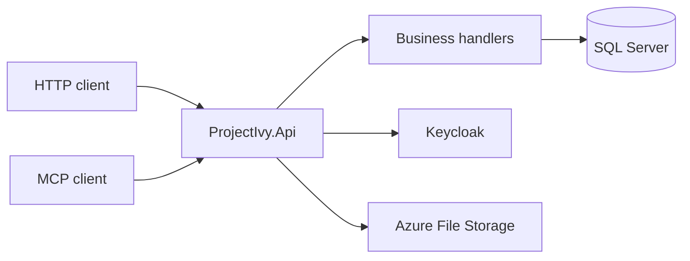

# Project Ivy API

Personal API for Project Ivy: money, travel, location, media, and day-to-day records behind one authenticated HTTP surface. It is an ASP.NET Core application on .NET 10 that talks to an existing SQL Server database.

Swagger UI is served at `/swagger`. An MCP endpoint is mapped at `/mcp` for a small set of tools (expenses and beer volume).

## What it covers

| Area | Examples |
| --- | --- |
| Money | Accounts, banks, cards, expenses, income, loans, vendors |
| Travel | Trips, stays, flights, airports, rides, cars, routes |
| Place | Tracking, geohash, points of interest, cities, countries |
| Life | Calendar, journal, to-dos, work days, calls, people, inventory |
| Media | Movies, beer, Last.fm artists and tracks |
| Files | Azure File Storage |

Every controller action requires an authenticated user. The current user comes from the Keycloak email claim.

## Stack

- ASP.NET Core on .NET 10, controllers and handler classes
- Entity Framework Core against an existing SQL Server database (no migrations in this repo)
- Keycloak JWT bearer authentication, with scope policies
- Swagger, Serilog (console, rolling file, Graylog), Prometheus metrics
- MCP tools that call the same handlers as the HTTP API



## Requirements

- [.NET 10 SDK](https://dotnet.microsoft.com/download)
- SQL Server database already shaped for `MainContext`
- A Keycloak realm that issues tokens for this API
- Graylog, if you want the process to start (the logger is configured in `Main`)

## Configuration

Settings come from `src/ProjectIvy.Api/appsettings.json` and environment variables. Do not commit connection strings or secrets.

These are read when the process starts. A missing value stops startup.

| Variable | Used for |
| --- | --- |
| `OAUTH_AUTHORITY` | Swagger OAuth authorize and token URLs |
| `GRAYLOG_HOST` | Serilog Graylog sink |
| `GRAYLOG_PORT` | Serilog Graylog sink (integer) |
| `CONNECTION_STRING_AZURE_STORAGE` | Azure File Storage client |

These are read when the matching feature runs:

| Variable | Used for |
| --- | --- |
| `CONNECTION_STRING_MAIN` | SQL Server connection opened by handlers |
| `LAST_FM_KEY` | Last.fm requests |

`USE_HTTP2`, when set to any value, makes Kestrel serve HTTP/2. Leave it unset for the default HTTP/1.1 listener.

Keycloak itself is the `Keycloak` section in `appsettings.json` (`realm`, `auth-server-url`, `resource`). Override any of those with the usual ASP.NET Core environment variable form, for example `Keycloak__realm`.

Bearer validation uses `Authentication:Schemes:Bearer:Authority`. Tokens are read from the `Authorization: Bearer` header or the `AccessToken` cookie.

## Run locally

```bash
export OAUTH_AUTHORITY="https://your-keycloak/realms/ivy"
export GRAYLOG_HOST="localhost"
export GRAYLOG_PORT="12201"
export CONNECTION_STRING_AZURE_STORAGE="DefaultEndpointsProtocol=https;AccountName=...;AccountKey=...;EndpointSuffix=core.windows.net"
export CONNECTION_STRING_MAIN="Server=localhost;Database=ProjectIvy;User Id=...;Password=...;TrustServerCertificate=True"
export LAST_FM_KEY="your-lastfm-key"

dotnet run --project src/ProjectIvy.Api
```

Then open `/swagger`. The listening URL is whatever Kestrel prints at startup (typically `http://localhost:5000` when no `launchSettings.json` is present).

```bash
dotnet build ProjectIvy.sln
dotnet test test/ProjectIvy.Data.Test/ProjectIvy.Data.Test.csproj
```

## Docker

The image is a multi-stage build on `mcr.microsoft.com/dotnet/aspnet:10.0`. The official ASP.NET runtime listens on port **8080**.

```bash
docker build -t project-ivy-api .
docker run --rm -p 8080:8080 --env-file .env project-ivy-api
```

Azure Pipelines on `master` and `mcp` builds that image and pushes `mateanticevic/project-ivy-api`.

## Authentication

Keycloak issues the JWT. `Startup` registers a policy for each value in `ApiScopes` (`basic:user`, `expense:user`, `tracking:create`, and the rest). Endpoints that declare a scope require that scope on the token.

Requests under `/mcp` use MCP authentication. Everything else uses the Keycloak JWT scheme.

## Project layout

| Project | Role |
| --- | --- |
| `src/ProjectIvy.Api` | Controllers, `Startup`, MCP tools. No database access. |
| `src/ProjectIvy.Business` | Handlers and binding-to-entity maps. |
| `src/ProjectIvy.Data` | EF Core `MainContext`, query filters, embedded SQL. |
| `src/ProjectIvy.Model` | `Binding` (input), `View` (output), `Database` (entities). |
| `src/ProjectIvy.Common` | Shared helpers. |
| `test/ProjectIvy.Data.Test` | xUnit tests for data helpers. |

A request goes controller → handler → `MainContext`. Handlers are registered in `Startup.ConfigureServices` with `services.AddHandler<IRideHandler, RideHandler>()`.

`Ride` is the reference feature: `RideController`, `IRideHandler` / `RideHandler`, `RideBinding`, and `Model/View/Ride/Ride`. Public ids are string `ValueId`s. Integer database ids stay off bindings and views.

There are no EF migrations. `MainContext` maps the database you already have. Raw SQL lives in `src/ProjectIvy.Data/Sql/Main/Scripts` and is loaded with `SqlLoader`.
